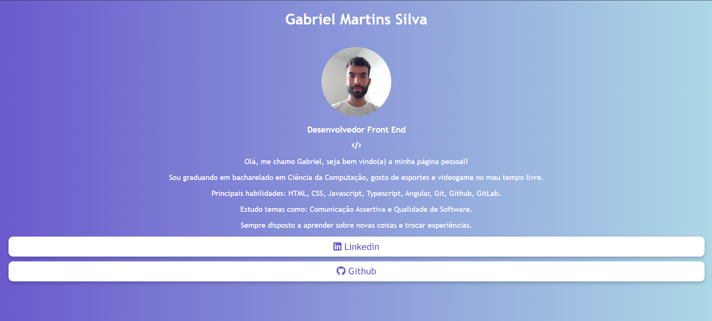

# Linktree Profile


# Sobre o projeto

Link para utilizar o projeto: [Linktree Profile](https://linktreeprofilegabrielmartinssilva.netlify.app/)

Linktree Profile é um projeto que vou iniciado pelas atividades no curso do [Mimo](https://mimo.org/).

A aplicação consiste em um cartão de visita do meu perfil, enquando profissional de tecnologia, com os principais contatos e projetos associados a mim.


## Layout mobile


## Layout web



# Tecnologias utilizadas
- HTML
- CSS

# Como executar o projeto
```bash
# clonar repositório
git clone https://github.com/gmartinssilva/linktree-profile.git

# Entrar na pasta do projeto e abrir o arquivo index.html no seu navegador
```

# Autor

Gabriel Martins Silva

https://www.linkedin.com/in/gabrielmartinssilva/

# Referências

[Badges](https://github.com/Ileriayo/markdown-badges)
